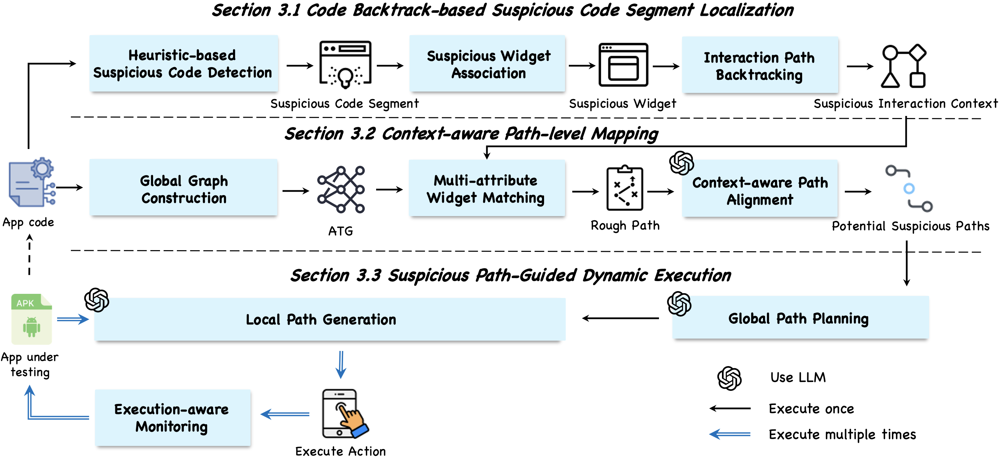
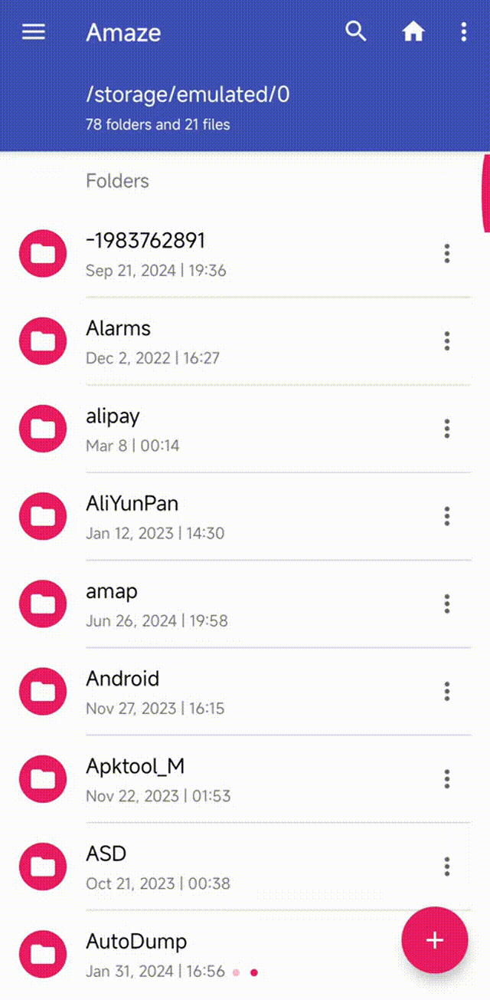
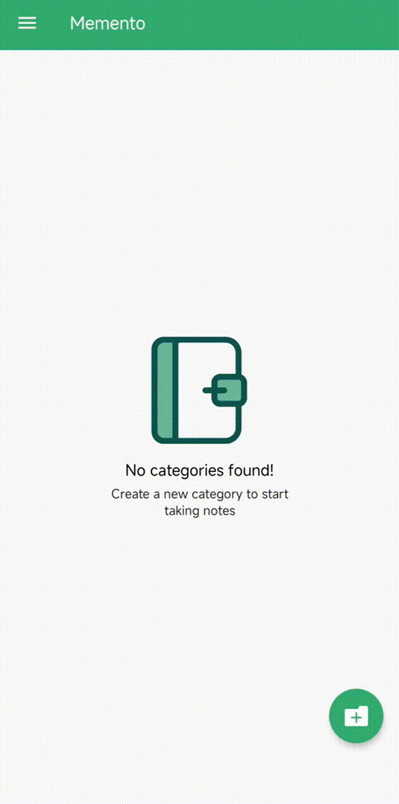
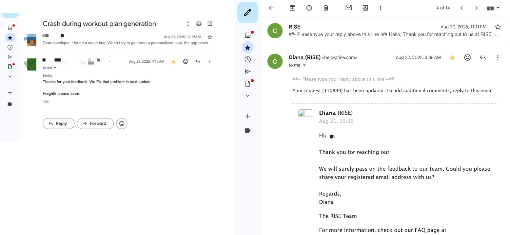

# TraceDroid

## 📖 Overview

TraceDroid is an automated GUI testing approach that leverages suspicious code traces to guide dynamic exploration for crash bug detection in Android apps.



## 🚀 Key Features

- **Code-Inspired Testing**: Uses heuristic rules to localize suspicious code segments
- **Context-Aware Tracing**: Backtracks code to GUI widgets and reconstructs interaction contexts
- **LLM-Powered Path Completion**: Employs large language models for missing path reasoning
- **Multi-Attribute Widget Matching**: Integrates ID, text, type, structure, and binding information
- **Execution-Aware Monitoring**: Real-time crash detection and path validation
- **High Bug Detection Recall**: Achieves 77% recall, outperforming 15 state-of-the-art baselines

## Examples

These are examples from testing applications using our method, TraceDroid.

<div align="center">
  
  
  
  <br>
  
  
  
</div>


## Code

See details in `code/`.

Follow the steps below to set up, configure, and run the available components.

### Environment Setup

#### 1. Android Studio Setup
1. Download Android Studio from [official website](https://developer.android.com/studio)
2. Install Android Studio following the installation wizard
3. Launch Android Studio and complete the initial setup

#### 2. Android Virtual Device (AVD) Setup
1. Open Android Studio
2. Click "Tools" > "Device Manager" > "Create Virtual Device"
3. Select a device definition (e.g., Pixel 2)
4. Select a system image:
   - Choose x86 Images for better performance
   - Recommended: API 30 (Android 11.0) or higher
   - Download the system image if not available
5. Configure AVD settings:
   - Set device name
   - Adjust RAM size (recommended: 2GB or more)
   - Set internal storage (recommended: 2GB or more)
6. Click "Finish" to create the AVD

#### 3. Physical Device Setup (Alternative)
1. Enable Developer Options on your Android device:
   - Go to Settings > About Phone
   - Tap "Build Number" 7 times
2. Enable USB debugging in Developer Options
3. Connect device via USB
4. Allow USB debugging on device when prompted

#### 4. Python Environment

Create and activate a conda environment, then install dependencies:

```bash
cd /path/TraceDroid/code/tracedroid
conda create -n tracedroid python=3.10 -y
conda activate tracedroid
pip install -r requirements.txt
```

### Configurations

Edit `tracedroid/config.ini`:

```ini
[uiautomator2]
; android_device = <device_serial>   ; optional, required only for dynamic execution

[llm]
openai_base_url = <your_openai_base_url_or_https://api.openai.com/v1>
openai_api_key  = <your_api_key>
openai_model    = gpt-4o-mini
```

You can quickly validate your LLM connections:

```bash
python test_gpt_connection.py
```

Add apk and code files:

- APK file: put an APK into `code/tracedroid/apks/`. The demo `main.py` expects `apks/xx.apk` by default. Adjust as needed.
- Source Code Files: put source code in `repo_root/` path.

### Run

Run:

```bash
conda activate tracedroid
cd /path/TraceDroid/code/tracedroid
python main.py
```


### Heuristic Rule Examples

Below are provided some examples of heuristic rules in different categories. For the complete rules, please refer to the `tracedroid/heuristic_detection.py` document.

#### 1. Null Pointer Exceptions

This type of rule is primarily used to detect unsafe access to objects that may be `null` without prior validation.

* **Rule 1.1: Uninitialized UI Component Access**
    * **Description:** Before calling a method of a UI component (such as `TextView` or `Button`), it is mandatory to check whether the component has been successfully initialized via `findViewById` or view binding. Directly accessing the component before `onViewCreated` in a Fragment or before the asynchronous layout loading is completed is a high-risk operation.

* **Rule 1.2: Object Access in Asynchronous Callbacks**
    * **Description:** When accessing external objects (especially member variables of an Activity/Fragment) in the callback methods (e.g., `onSuccess`, `onResponse`) of asynchronous operations such as network requests or database queries, you must first check whether the object has been destroyed due to lifecycle changes (e.g., screen rotation, page closure).

* **Rule 1.3: Iteration over API-Returned Collections**
    * **Description:** Before iterating over a collection or array returned by a method (especially those from APIs or system libraries) (e.g., using a for-each loop), a `null` check must be performed on the collection itself to prevent crashes caused by the interface returning `null` instead of an empty collection.


#### 2. Runtime Exceptions and Error Handling

This type of rule focuses on identifying crashes caused by the lack of necessary exception handling or violations of regulations in specific runtime environments (e.g., the Android UI framework).

* **Rule 2.1: UI Update on Non-UI Thread**
    * **Description:** Any operation that modifies the properties of a UI component (e.g., `setText`, `setVisibility`) must be wrapped in `Activity.runOnUiThread()` or executed via a `Handler` associated with the main thread if its call chain may originate from a background thread.

* **Rule 2.2: Resource ID Validity Check**
    * **Description:** When using dynamically generated resource IDs or those obtained from external sources (e.g., `getResources().getDrawable(id)`), the operation must be wrapped in a `try-catch` block to catch `Resources.NotFoundException`, as the ID may be invalid or have been removed.

* **Rule 2.3: Guarded Type Casting**
    * **Description:** Before performing an explicit object type cast, the `instanceof` keyword must be used for checking to prevent a `ClassCastException` caused by a mismatch between the actual type of the object and the expected type.


#### 3. External Integration and Compatibility

This type of rule aims to detect crashes caused by incompatibilities with device environments, system versions, or third-party libraries.

* **Rule 3.1: API Level Compatibility Check**
    * **Description:** Before calling any API introduced in a specific Android version, `Build.VERSION.SDK_INT` must be used to check whether the system version of the current device meets the minimum requirements, ensuring the app's compatibility on devices with older versions.

* **Rule 3.2: Runtime Permission Verification**
    * **Description:** Before performing an operation that requires dangerous permissions (e.g., accessing the camera, reading contacts), `Context.checkSelfPermission()` must be called to verify whether the permission has been granted; otherwise, a `SecurityException` may occur.


#### 4. Concurrency and Resource Management

This type of rule is used to identify race conditions, resource leaks, and improper component state management issues in multi-threaded programming.

* **Rule 4.1: Fragment State-Safe Access**
    * **Description:** Before performing a transaction (e.g., `commit`) on a Fragment or calling its methods that require a context (e.g., `getContext()`), its lifecycle state must be checked—for example, using `isAdded()` or `isResumed()`—to prevent an `IllegalStateException` caused by operations when the Fragment is not attached to an Activity.

* **Rule 4.2: Atomic Access to Shared Variables**
    * **Description:** When a mutable variable is read from and written to by multiple threads simultaneously, the `synchronized` keyword, `volatile` keyword, or atomic classes from the `java.util.concurrent.atomic` package must be used to ensure the atomicity and visibility of operations, preventing data inconsistency.


* **Rule 4.3: Explicit Closing of Resource Objects**
    * **Description:** For resource objects that implement the `Closeable` interface (e.g., `Cursor`, `InputStream`, `OkHttp ResponseBody`), their `close()` method must be called in a `finally` block or a `try-with-resources` statement to avoid resource leaks.


#### 5. Database Operation Issues

This type of rule mainly focuses on problems caused by improper database usage, such as query errors, data overflow, or misuse of ORM frameworks.

* **Rule 5.1: Database Transaction Size Limitation**
    * **Description:** When executing database transactions—especially when inserting large BLOB data—the data size should be checked to see if it is close to SQLite's `SQLITE_MAX_LENGTH` limit. For oversized data, file storage paths should be used instead of directly storing the data in the database.


* **Rule 5.2: Cursor Column Existence Check**
    * **Description:** Before retrieving data from a `Cursor` by column name, `getColumnIndex()` should be called first, and the return value should be checked to see if it is `-1`. This prevents an `IllegalArgumentException` caused by changes to the database table structure (e.g., columns being deleted or renamed).


## Pilot Study Dataset

See details in `pilot_study_dataset/`.

The data of pilot study: [google drive link](https://drive.google.com/file/d/19o99vec36Z4VFzwBGJ_iLlY30cccMFqs/view?usp=sharing)

This dataset supports the motivational study of TraceDroid, focusing on analyzing real-world crash bug patterns in Android applications. The data is curated to identify recurrent crash root causes, which directly inform the design of TraceDroid's heuristic rules for suspicious code detection.

### Data Collection

#### 1. Source Selection

We randomly selected **300 open-source Android apps** from GitHub, focusing on projects that meet the following criteria:

- Active maintenance (evidenced by at least 100 GitHub stars or 50 commits to ensure project relevance).
- Publicly accessible issue trackers with explicit labels (e.g., "crash", "bug") to identify crash-related reports.
- Linked code repositories to map issue reports to concrete code modifications (critical for validating crash root causes).

#### 2. Filtering Criteria

To ensure data quality and alignment with the study’s goal of analyzing actionable crash bugs, we applied two core filters:

1. **Crash Bug Validation**: The issue report must explicitly describe an app crash (e.g., "force close", "unexpected termination", or include stack trace snippets for exceptions like `NullPointerException`).
2. **Code Traceability**: The report must be linked to a GitHub commit (via "Fixes #XXX" or similar annotations) that directly resolves the crash, enabling verification of the bug’s root cause through code changes.

#### 3. Manual Verification

Two authors independently reviewed each candidate issue to confirm:

- The issue reflects a genuine crash (not a feature request, performance concern, or UI glitch).
- The linked commit addresses the crash (not unrelated refactoring or minor fixes).
A third author resolved discrepancies until **full consensus** was reached, reducing the initial 5,783 issues to 1,639 valid crash bugs.


### Crash Bug Categorization

Based on the **card sorting method**, we classified the 1,639 crash bugs into **5 major categories** (and subcategories) by root cause, triggering context, and functional scenario. This classification directly informed TraceDroid’s heuristic rule design and aligns with real-world mobile app crash distributions:

#### 1. Null Pointer Exceptions (29%)

Crashes from accessing uninitialized/null objects without validation.  

Subcategories:

- GUI binding failures (e.g., accessing views before data loading completes).
- Asynchronous data access (e.g., callbacks referencing released objects).
- Collection/array null access (e.g., list access without null checks).  

**Typical Scenarios**: News feeds, media galleries, chat lists (data-heavy UI updates).

#### 2. Runtime Exceptions and Error Handling (27%)

Crashes from missing or insufficient exception handling during critical operations.  

Subcategories:

- UI thread violations (e.g., updating UI from background threads).
- Resource misuse (e.g., invalid resource IDs, missing assets like images).
- Type/encoding errors (e.g., failed type casting, character encoding mismatches).  

**Typical Scenarios**: Background uploads, scans, data backups.

#### 3. External Integration and Compatibility (19%)

Crashes from incompatibilities with external systems or platforms.  

Subcategories:

- Third-party API changes (e.g., unadapted updates to Google Maps/Pay APIs).
- Platform-specific behaviors (e.g., Android 12+ permission changes breaking older code).
- Permission/manifest issues (e.g., missing required permissions, invalid manifest declarations).  

**Typical Scenarios**: Apps relying on external services (payment, location) or hardware integrations.

#### 4. Concurrency and Resource Management (14%)

Crashes from improper handling of concurrent processes or system resources.  

Subcategories:

- Repeated component start (e.g., multiple `startService()` calls in quick succession).
- State check omissions (e.g., operating on an uninitialized activity).
- Non-atomic variable access (e.g., race conditions in shared resource access).  

**Typical Scenarios**: Content sharing, user status updates (shared resource-intensive features).

#### 5. Database Operation Issues (11%)

Crashes from database misuse or exceeding system limits.  

Subcategories:

- Data size limit exceeded (e.g., BLOBs larger than SQLite constraints).
- Incorrect query/comparator (e.g., invalid SQL, broken sorting logic).
- ORM misuse (e.g., improper Room/Hibernate API calls).  

**Typical Scenarios**: Note-taking apps, accounting tools (data-persistent applications).


### Dataset Structure
The dataset is organized in **CSV/JSON format** with the following fields per crash bug entry, aligned with the structure specified:

| Field               | Description                                                                 |
|---------------------|-----------------------------------------------------------------------------|
| `app_name`          | Name of the Android app|
| `github_link`       | Direct URL to the app’s GitHub repository |
| `fdroid_link`       | URL to the app’s F-Droid page |
| `app_desc`          | Brief description of the app’s core functionality |
| `category`          | Functional category of the app |
| `issue_url`         | Direct URL to the GitHub issue report |
| `issue_title`       | Title of the GitHub issue |
| `issue_content`     | Full text of the issue report |

### Data Access

The data can be viewed at [google drive link](https://drive.google.com/file/d/19o99vec36Z4VFzwBGJ_iLlY30cccMFqs/view?usp=sharing).


## Experiment Dataset

See details in `experiment_dataset/`.

### RQ1&RQ2

The data of RQ1&RQ2: [google drive link](https://drive.google.com/file/d/1FfFeHIqTq9uEvQ3vxFXxhLki-i_HRXo9/view?usp=sharing)

This dataset supports the evaluation of **RQ1 (Detection Effectiveness and Coverage)** and **RQ2 (Ablation Study)** in the paper TraceDroid. It contains 70 confirmed crash bugs from 42 open-source Android applications, including their corresponding APK files and metadata (e.g., bug reports, fix links) to ensure full experiment reproducibility.


#### Data Access

The dataset is hosted on Google Drive. You can download it via the following link:  
[Google Drive Download Link](https://drive.google.com/file/d/1FfFeHIqTq9uEvQ3vxFXxhLki-i_HRXo9/view?usp=sharing)  

After downloading, unzip the compressed file using standard tools to access the complete dataset.


#### File Structure

After unzipping, the dataset follows this 2-level structure:

```
.
├── apks
│   ├── 1.apk
│   ├── 2.apk
│   ├── 3.apk
│   ├── ... (70 APK files total, named 1.apk to 70.apk)
│   ├── 69.apk
│   └── 70.apk
└── RQ1&RQ2.csv
```

##### Key Directories/Files

- **`apks/`**: Stores 70 Android APK files (named `1.apk` to `70.apk`). Each APK corresponds to a specific version of an open-source app that contains one confirmed crash bug. These APKs are used to run GUI testing experiments (TraceDroid, baselines, and ablation variants) for RQ1 and RQ2.  
- **`RQ1&RQ2.csv`**: A metadata file that links each crash bug to its original project, bug report, reproduction steps, and fix. This enables traceability and validation of the bugs used in the experiments.


#### CSV File Description

The `RQ1&RQ2.csv` file has 5 columns, with one row per crash bug (matching the 70 APKs in `apks/`). The columns are defined as follows:

| Column Name   | Description                                                                 |
|---------------|-----------------------------------------------------------------------------|
| `index`       | Unique numerical ID for the crash bug (1–70), directly mapping to the APK filename (e.g., `index=10` corresponds to `10.apk`). |
| `github_link` | URL of the open-source app’s GitHub repository where the crash bug occurred. |
| `issue_link`  | URL to the original GitHub Issue report describing the crash bug (includes bug symptoms, user feedback, and initial reproduction notes). |
| `reproduce`   | Concise text summary of the **verified manual reproduction steps** for the crash bug (aligned with the steps used to validate experiment results in the paper). |
| `fix_link`    | URL to the GitHub Commit or Pull Request that fixes the crash bug (used to confirm the bug’s authenticity and resolution). |

### RQ3


RQ3 extends beyond controlled open-source datasets to validate TraceDroid’s real-world value. We tested TraceDroid alongside 5 top-performing baselines (selected from RQ1’s results) on popular Android apps from Google Play. The focus was on: 

- Identifying **previously unreported crash bugs** (not documented in public issue trackers).  
- Verifying bug validity through direct **developer feedback** (fixes or confirmations).  


#### Dataset Selection Criteria

To ensure reproducibility and representativeness, apps were selected using strict filters:  

| Criterion | Description |  
|-----------|-------------|  
| Initial Pool | 200 randomly selected popular apps from Google Play, spanning categories (e.g., Productivity, Fitness, Finance) to ensure functional diversity. |  
| Filter 1: Decompilability | Apps must be decompiled to retrieve source code (required for TraceDroid’s heuristic-based suspicious code detection). |  
| Filter 2: UI Accessibility | UIAutomator (Android testing tool) must extract both **view hierarchies** (for widget identification) and **GUI screenshots** (for runtime validation). |  
| Final Dataset | 116 apps remained post-filtering, with download volumes ranging from 500K+ to 5M+. |  


#### Full RQ3 Experimental Data Table

Below is the complete dataset of detected bugs (reproduced from Table 3 in the source document), including app details, bug status, and baseline detection results.  

| ID  | App Name          | Download | Category   | Version  | Status     | TimeM | Comb | Huma | Guard | BugH |  
|-----|-------------------|----------|------------|----------|------------|-------|------|------|-------|------|  
| 1   | Journal           | 5M+      | Product    | 131      | Status     |       |      |      |       |      |  
| 2   | Height Increase   | 5M+      | Fitness    | 1.1.8    | Fixed      |       |      |      |       |      |  
| 3   | Offline Music     | 5M+      | Music      | 1.34.1   | Fixed      |       |      |      | *     | *    |  
| 4   | DailyLife         | 5M+      | Lifestyle  | 4.3.1    | Fixed      |       |      |      |       |      |  
| 5   | Easy Notes        | 1M+      | Product    | 1.3.23   | Fixed      |       | *    |      |       | *    |  
| 6   | Expense Tracker   | 1M+      | Finance    | 1.01     | Fixed      |       |      |      |       |      |  
| 7   | My Cash           | 1M+      | Enter      | 38       | Confirmed  |       |      |      | *     |      |  
| 8   | BetterMe          | 1M+      | Health     | 9.31     | Fixed      |       | *    |      |       | *    |  
| 9   | Daily Yoga        | 1M+      | Sport      | 1.2.1    | Fixed      |       |      |      |       |      |  
| 10  | Daily Routine     | 1M+      | Tool       | 1.1.10   | Confirmed  |       |      |      |       |      |  
| 11  | FreeYourMusic     | 1M+      | Music      | 9.17.0   | Fixed      |       |      | *    |       |      |  
| 12  | Weather Forecast  | 1M+      | Weather    | 2.1      | Confirmed  |       |      |      |       | *    |  
| 13  | Add Text          | 1M+      | Photo      | 2.7      | Fixed      | *     |      |      | *     |      |  
| 14  | SideChef          | 1M+      | Food       | 5.31.1   | Fixed      |       |      |      |       |      |  
| 15  | RISE              | 1M+      | Lifestyle  | 1.78.33  | Fixed      |       |      |      |       |      |  
| 16  | Timetable         | 1M+      | Education  | 2.3.1    | Confirmed  |       |      |      |       |      |  
| 17  | Daily Planner     | 1M+      | Product    | 63       | Fixed      | *     | *    | *    | *     | *    |  
| 18  | Headout           | 1M+      | Travel     | 8.19.0   | Confirmed  |       |      |      |       |      |  
| 19  | MyMoney           | 1M+      | Finance    | 5.7      | Fixed      |       |      |      |       |      |  
| 20  | Quabble           | 500K+    | Health     | 2.6.8    | Confirmed  |       |      |      |       | *    |  
| 21  | EdrawMind         | 500K+    | Tool       | 7.9.1    | Fixed      |       |      |      |       |      |  

*Notes: \* indicates the baseline detected the bug; empty cells mean the bug was not detected. Baselines are abbreviated as follows: TimeM (Time-Machine), Comb (ComboDroid), Huma (Humanoid), Guard (Guardian), BugH (BugHunter).*  

Here are some examples of developers' reply:




#### Data Fields Explanation

Each column in the table is defined below for clarity:  

| Field       | Description                                                                 |  
|-------------|-----------------------------------------------------------------------------|  
| `ID`        | Unique identifier for each detected bug (1–21).                             |  
| `App Name`  | Name of the Google Play app where the bug was found.                        |  
| `Download`  | App’s estimated download volume (indicates popularity).                     |  
| `Category`  | App’s functional category (per Google Play’s classification).               |  
| `Version`   | Exact app version tested (critical for reproducing bugs).                   |  
| `Status`    | Bug validation status (see Section 5 for definitions).                     |  
| `TimeM`     | Whether Time-Machine (random/rule-based baseline) detected the bug.         |  
| `Comb`      | Whether ComboDroid (model-based baseline) detected the bug.                 |  
| `Huma`      | Whether Humanoid (learning-based baseline) detected the bug.                |  
| `Guard`     | Whether Guardian (LLM-based baseline) detected the bug.                     |  
| `BugH`      | Whether BugHunter (bug-driven baseline) detected the bug.                   |  


#### Bug Status Definitions

Bugs were classified based on direct feedback from app developers:  

| Status     | Definition                                                                 |  
|------------|-----------------------------------------------------------------------------|  
| `Fixed`    | Developer confirmed the bug and released an update to resolve it (15/21 bugs). |  
| `Confirmed`| Developer acknowledged the bug as valid but had not fixed it at submission (6/21 bugs). |  
| `Status`   | No developer feedback recorded for this entry (ID 1 only).                  |  


#### Key Experimental Results

From the dataset, the following key findings validate TraceDroid’s utility:  
- **Total Unknown Bugs**: TraceDroid detected 21 previously unreported crash bugs across 116 apps.  
- **Developer Validation**: 100% of detected bugs were validated (15 fixed, 6 confirmed).  
- **Baseline Comparison**: The top-performing baseline (BugHunter) detected only 6 of these 21 bugs—all were a subset of TraceDroid’s detections. No other baseline found additional bugs.  


#### Access to Supplementary Materials

All RQ3 supplementary materials are publicly available in the TraceDroid repository, including:  
- **Bug Reproduction Guides**: Step-by-step instructions to replicate each detected bug.  
- **Developer Feedback Screenshots**: Emails/messages from developers confirming/fixing bugs.  
- **Test Logs**: Raw execution logs for TraceDroid and baselines (with bug detection timestamps).  

